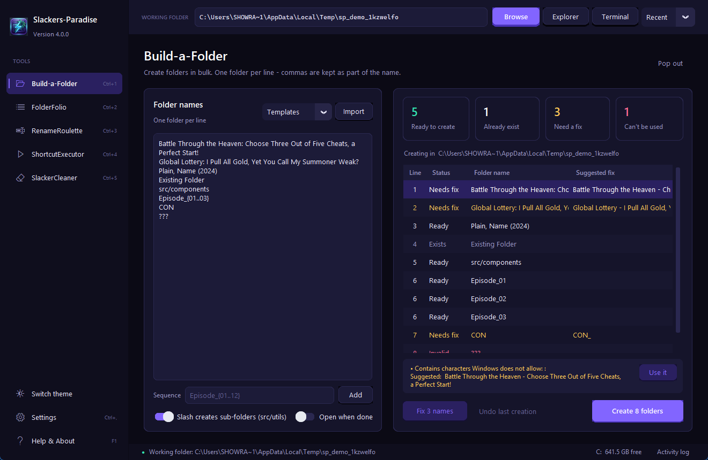

# Slackers-Paradise

<p align="center"><strong>Folder &amp; file automation for Windows.</strong><br/>Build folders in bulk, catalog directories, batch-rename safely, launch shortcuts, clean junk.</p>

<p align="center">
  
  
  
  
</p>

<p align="center"></p>

---

## Tools

| Tool | What it does |
|---|---|
| **Build-a-Folder** | One folder per line - commas are never treated as separators. Live preview flags every name Windows would reject and **suggests a fix** (`Title: Subtitle?` becomes `Title - Subtitle`). Sequences (`Episode_{01..12}`), nested paths, templates, `.txt` import, undo. |
| **FolderFolio** | Catalog a folder and export as list, ASCII tree, CSV, Markdown or JSON. Live filter, sortable columns, background scanning. |
| **RenameRoulette** | Roulette, sequential, find/replace (regex, match case), date stamp and case modes. Natural sorting, conflict and invalid-name detection, multi-level undo. |
| **ShortcutExecutor** | Launch many `.lnk` / `.url` / `.bat` / `.cmd` / `.exe` files with a delay between each. Double-click to launch one; Stop works instantly. |
| **SlackerCleaner** | Finds old temp files, nested empty folders and broken shortcuts. Review, untick, clean. Folders and shortcuts go to the Recycle Bin. |

## Folder names that "just work"

Paste titles exactly as they are:

```
Battle Through the Heaven: Choose Three Out of Five Cheats, a Perfect Start!
Global Lottery: I Pull All Gold, Yet You Call My Summoner Weak?
```

Each line stays one folder. Windows forbids `: ? " * | < >`, so both lines are marked **Needs fix** with these suggestions:

```
Battle Through the Heaven - Choose Three Out of Five Cheats, a Perfect Start!
Global Lottery - I Pull All Gold, Yet You Call My Summoner Weak
```

Use **Use it** on one line, **Fix N names** for all, or let *Create* apply the suggestions for you. Reserved names (`CON`, `NUL`...), trailing dots/spaces, control characters and over-long paths are caught too.

## Keyboard shortcuts

| Shortcut | Action |
|---|---|
| `Ctrl+1` ... `Ctrl+5` | Switch tool |
| `Ctrl+O` | Choose working folder |
| `Ctrl+L` | Activity log |
| `Ctrl+,` | Settings |
| `F1` | Help |

## Install

**Portable:** download `Slackers-Paradise.exe` from [Releases](https://github.com/Smokianlord/Slackers-Paradise/releases) and run it.

**From source** (Python 3.10+):

```powershell
git clone https://github.com/Smokianlord/Slackers-Paradise.git
cd Slackers-Paradise
pip install -r requirements.txt
python app.py
```

**Build the exe:**

```powershell
python -m PyInstaller Slackers-Paradise.spec --distpath . --noconfirm
```

**Run the tests:**

```powershell
python -m unittest discover -s tests -t .
```

## Safety

- Nothing is changed until you confirm; every tool previews first.
- Renames are two-phase (no chain collisions) and fully undoable, including swaps.
- Folder creation can be undone - only still-empty folders are removed.
- The cleaner refuses drive roots, your user profile and Windows folders, skips recently modified temp files and uses the Recycle Bin for folders and shortcuts.
- Settings live in `%APPDATA%\SlackersParadise\config.json`.

## License

[MIT](LICENSE)
